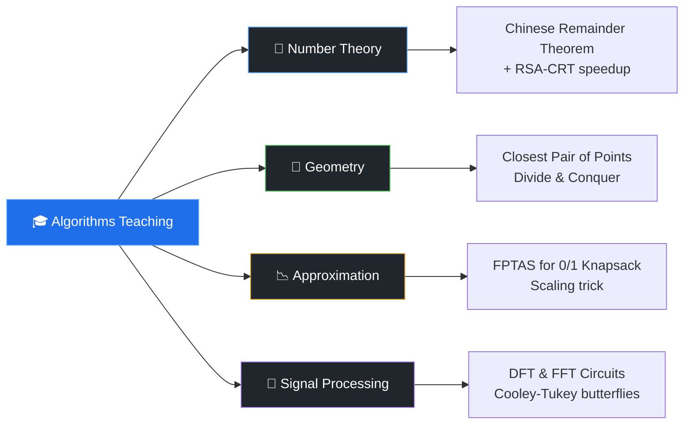

<div align="center">

# 🎓 Algorithms Teaching — Interactive Lecture Notes

### *A collection of self-contained, interactive HTML lessons for advanced algorithms.*

[](https://developer.mozilla.org/en-US/docs/Web/HTML)
[](https://developer.mozilla.org/en-US/docs/Web/JavaScript)
[](https://developer.mozilla.org/en-US/docs/Web/SVG)
[](#)
[](#license)

```
┌──────────────────────────────────────────────────────────────────┐
│                                                                  │
│    📚  Four lessons.   🎬  Live animations.   🔬  No frameworks. │
│                                                                  │
└──────────────────────────────────────────────────────────────────┘
```

</div>

---

## ✨ What is this?

This repository hosts a small but carefully crafted set of **interactive teaching pages** for non-trivial algorithms. Each lesson is a single HTML file — drop it in a browser and you get:

- 📝 **Structured lecture notes** with proofs, intuition, and complexity analysis
- 🎮 **Live visualizations** — drag, click, step, animate
- 🧮 **Pseudocode panels** with line-by-line highlighting synced to the animation
- 📊 **Worked examples** you can replay at any speed
- 🌗 **Dark, distraction-free UI** designed for long study sessions

No build step. No node_modules. No MathJax, no D3, no p5 — just vanilla JS, SVG, and a little Canvas.

---

## 🗺️ Topic Map



---

## 📚 Lessons

### 🔐 [Chinese Remainder Theorem & RSA-CRT](ChineseRemainder_RSA.html)

> *From simultaneous congruences to a 4× speedup of RSA decryption.*

| Section | Highlights |
|---|---|
| **What you'll learn** | CRT existence & uniqueness, the constructive proof via Extended Euclidean, and how RSA-CRT exploits factorization of `n = pq` |
| **Visuals** | Animated modular arithmetic, SVG congruence-class diagrams, interactive parameter sliders |
| **Worked example** | Reconstruct `x` from `x ≡ aᵢ (mod mᵢ)` step by step, then watch CRT accelerate RSA decrypt |
| **Complexity** | `O(k · log² M)` for k congruences with combined modulus M |

---

### 📍 [Closest Pair of Points — Divide & Conquer](ClosestPairPoints.html)

> *The classic O(n log n) sweep, with the 7-point strip lemma made visible.*

| Section | Highlights |
|---|---|
| **What you'll learn** | Why brute force is `O(n²)`, the divide step, the strip-conquer step, and *why* the magic constant is **7** |
| **Visuals** | 2D point canvas with split lines and strip overlays, live recursion-tree, the "7-point window" highlighted as it slides |
| **Worked example** | Drop your own points or use presets; watch δ shrink across recursive calls |
| **Complexity** | `T(n) = 2T(n/2) + O(n)` ⇒ `O(n log n)` |

---

### 🎒 [FPTAS for 0/1 Knapsack](FPTAS.html)

> *Trade a tunable ε for a polynomial running time on an NP-hard problem.*

| Section | Highlights |
|---|---|
| **What you'll learn** | Pseudo-polynomial DP, the value-scaling trick `v'ᵢ = ⌊vᵢ / K⌋`, the `(1−ε)` approximation guarantee, and PTAS vs FPTAS |
| **Visuals** | **Side-by-side DP tables** — exact on the left, scaled on the right — animated in lockstep so you can *see* the precision/time trade-off |
| **Worked example** | Tune ε on a slider and watch both runtime and approximation gap update live |
| **Complexity** | `O(n³ / ε)` with quality `≥ (1 − ε) · OPT` |

---

### 🌊 [DFT & FFT Circuits](dft_fft_circuits.html)

> *From the DFT matrix to butterfly circuits — Cooley-Tukey, demystified.*

| Section | Highlights |
|---|---|
| **What you'll learn** | Roots of unity, the DFT matrix, Cooley-Tukey decomposition, bit-reversal permutation, and the butterfly operation |
| **Visuals** | **Butterfly circuit SVG** with data flowing through layers, complex-plane spinner for ωₙ, frequency-domain output plot |
| **Worked example** | A full N=4 trace from input to output, layer by layer |
| **Complexity** | `O(n²)` (naive DFT) → `O(n log n)` (FFT) |

---

## 🏗️ Anatomy of a Lesson

Every page follows the same layout, so once you know one you know them all:

```
┌────────────────────────────────────────────────────────────────────┐
│  HEADER  ·  Lesson title + course tag                              │
├──────────────┬─────────────────────────────────────┬───────────────┤
│              │                                     │               │
│  CONTROLS    │       MAIN VISUALIZATION            │   LECTURE     │
│              │                                     │   NOTES       │
│  • Presets   │   ┌─────────────────────────────┐   │               │
│  • Custom    │   │                             │   │  • Problem    │
│    input     │   │      SVG / Canvas           │   │  • Intuition  │
│  • Speed     │   │      (animated)             │   │  • Proof      │
│  • Step /    │   │                             │   │  • Complexity │
│    Play      │   └─────────────────────────────┘   │  • Worked ex. │
│  • Stats     │                                     │               │
│              │   ┌─────────────────────────────┐   │  (collapsible │
│              │   │   PSEUDOCODE  +  HISTORY    │   │   roadmap)    │
│              │   └─────────────────────────────┘   │               │
└──────────────┴─────────────────────────────────────┴───────────────┘
```

**Color language** (consistent across all lessons):

| Swatch | Role |
|:---:|---|
| 🟦 `#1f6feb` | Active state / current step |
| 🟩 `#3fb950` | Success / accepted / final answer |
| 🟨 `#d29922` | Warning / candidate / under inspection |
| 🟪 `#bc8cff` | Decorative / structural overlays |
| ⬛ `#0d1117` | Background |

---

## 🚀 Getting Started

```bash
# 1. Clone
git clone https://github.com/pxrth1308/Algorithms_Teaching.git
cd Algorithms_Teaching

# 2. Open any lesson directly in your browser
open ChineseRemainder_RSA.html      # macOS
xdg-open ClosestPairPoints.html     # Linux
start FPTAS.html                    # Windows
```

That's it. There is genuinely no build step. ✨

> **Tip:** for the smoothest animations, use a Chromium-based browser (Chrome, Edge, Brave) or a recent Firefox.

### Optional: serve locally

If your browser blocks `file://` for any reason:

```bash
python3 -m http.server 8000
# then visit http://localhost:8000
```

---

## 📂 Repository Layout

```
Algorithms_Teaching/
├── 🔐 ChineseRemainder_RSA.html      Number theory · CRT · RSA-CRT
├── 📍 ClosestPairPoints.html         Computational geometry · D&C
├── 🎒 FPTAS.html                     Approximation · Knapsack
├── 🌊 dft_fft_circuits.html          FFT · Butterfly circuits
└── 📖 README.md                      You are here
```

Each `.html` file is **fully self-contained** — HTML, CSS, and JS live in the same document. You can hand a single file to a student over email and it will Just Work.

---

## 🎯 Who is this for?

- 👩‍🎓 **Students** preparing for algorithms exams who want intuition, not just slides
- 👨‍🏫 **Instructors** looking for drop-in interactive demos for lectures
- 🧑‍💻 **Self-learners** who already read CLRS and want to *play* with the algorithms
- 🤓 **Anyone curious** about how these results actually work, step by step

---

## 🤝 Contributing

Contributions, fixes, and new lessons are welcome! A good new lesson:

- ✅ Lives in a single self-contained `.html` file
- ✅ Follows the three-pane layout (controls · viz · notes)
- ✅ Has a worked example you can replay step by step
- ✅ Uses no external runtime dependencies (Google Fonts only is OK)

Open an issue to discuss the topic before sending a PR.

---

## 📜 License

Released under the **MIT License**. Use these lessons in your own course, remix them, share them — just keep the attribution.

---

<div align="center">

*If a lesson helped you understand something, ⭐ the repo — it really does help.*

</div>
